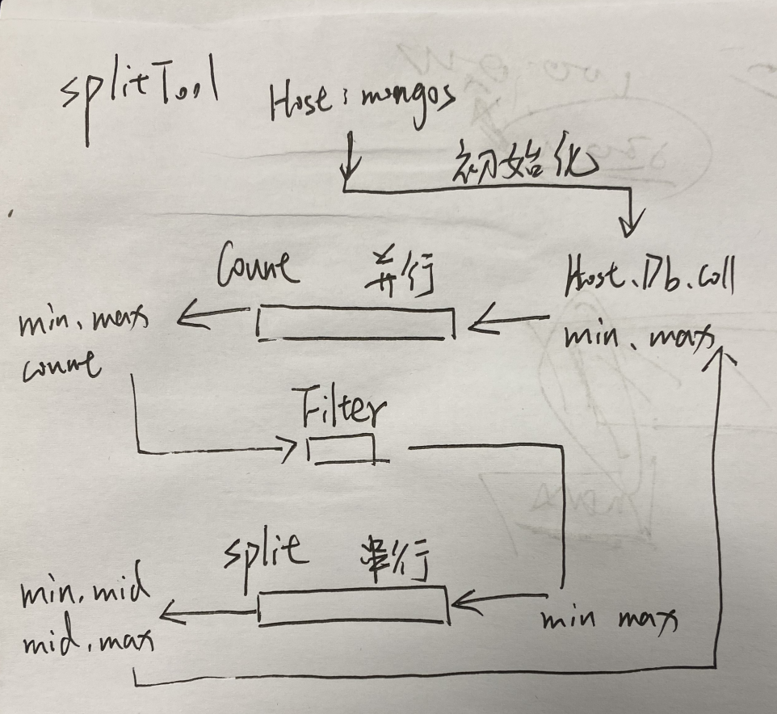

# TinyProjects
一些小项目

项目名称 | 简介
---- | ----
miniShell | c语言实现shell的基本功能    
gee | 简单的路由框架，前缀树解析路径、实现中间件Next()功能
[geeCache](https://github.com/pojiang20/Geecache) | 简单的分布式缓存，LRU缓存淘汰、一致性哈希处理请求

## 模型 
工作中的一些简单的结构/模型记录
#### splitTool

用于monogo手动分片，本质上是两个消费者处理消息，但消息可能需要再次处理。